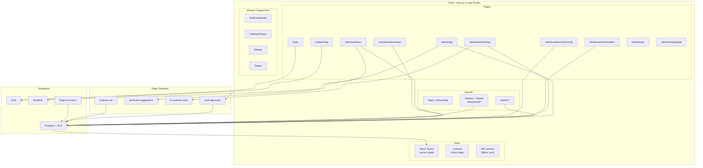

# HappyDebt Client Portal — PLAN.md (Phase 0)

Este documento define la arquitectura, datos, componentes, rutas, estado e instrumentación PLG antes de escribir código.

---

## 1. Architecture diagram (Mermaid)

**Data flow summary:** Auth → Supabase Auth + RLS; server state → React Query; client state → Zustand; filters/sort → URL params.

---

## 2. Data model

| Table | Key fields | Relationships |
|-------|------------|----------------|
| organizations | id, name, slug, logo_url, plan, trial_ends_at, stripe_customer_id | — |
| users | id (auth.users), org_id, email, full_name, avatar_url, role, onboarding_completed | org_id → organizations |
| closers | id, org_id, name, email, phone, avatar_url, active | org_id → organizations |
| live_transfers | id, org_id, closer_id, lead_*, business_name, transfer_date, status, amount, notes | org_id, closer_id → closers |
| call_recordings | id, org_id, closer_id, live_transfer_id, recording_url, duration_seconds, call_date, transcript, ai_analysis, sentiment_score, evaluation_score, strengths, improvement_areas, is_critical, critical_action_plan | org_id, closer_id, live_transfer_id |
| evaluation_templates | id, org_id, name, is_active, criteria (jsonb) | org_id → organizations |
| actionables | id, org_id, user_id, title, description, source_type, source_id, priority, status, due_date, assigned_to, completed_at | org_id, user_id, assigned_to → closers |
| plg_events | id, org_id, user_id, event_name, event_properties, session_id | org_id, user_id |
| feature_usage | id, org_id, user_id, feature_key, usage_count, first_used_at, last_used_at | UNIQUE(org_id, user_id, feature_key) |

**RLS:** org_id filter; happydebt_admin bypass; viewer = read-only except own actionables; manager = CRUD org data; admin = + user management.

---

## 3. Component tree

Layout (root), AuthLayout, LoginPage, OnboardingWizard, DashboardLayout, Sidebar, Topbar, KPIRow, LiveTransfersTable, DailyBarChart, DrillDownModal, CallAudioPlayer, SuggestionsBanner, CloserRankingPanel, SentimentChart, EvaluationScoreChart, CriticalCallsPanel, CloserDetailPage, ActionablesBoard, EvaluationTemplateEditor, OrgSettings, PLGDashboard, AdminOrgsList, AdminOrgDetail. Shared: Card, Badge, StatCard, Button, Input, Select, Table, Skeletons.

---

## 4. Route map

| Path | Layout | Auth |
|------|--------|------|
| / | — | Redirect to /dashboard or /login |
| /login, /onboarding | AuthLayout | Public / Authenticated |
| /dashboard/* | DashboardLayout | Authenticated, org scoped |
| /admin/* | AdminLayout | happydebt_admin only |

---

## 5. State management

React Query: server state (live_transfers, call_recordings, closers, actionables, templates, org, suggestions). Zustand: sidebar collapsed, view toggles. URL: filters, sort, pagination. Forms: local/react-hook-form. PLG: fire-and-forget Edge Function + feature_usage upsert.

---

## 6. PLG instrumentation

Events: page_view, session_start/end, recording_uploaded/played/completed, ai_analysis_viewed/drilled_down, actionable_created/completed/dismissed, template_viewed/edited/saved, closer_profile_viewed, critical_call_viewed, drill_down_opened, export_csv_clicked, upgrade_cta_clicked, onboarding_step_completed, suggestion_viewed/suggestion_saved_as_actionable. feature_usage keys: overview_viewed, voc_panel_used, actionable_saved, template_customized, recording_played, drill_down_used. Client: lib/plg.ts trackEvent() → Edge Function + feature_usage upsert.
